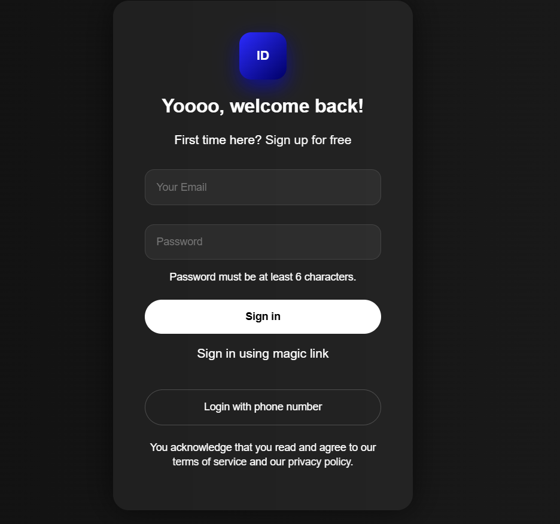

# 🌙 Modern - Login Card UI

A modern and stylish **Login Card UI** built using **HTML5 and CSS3**.
This project demonstrates the **Glassmorphism design trend**, which gives the interface a smooth **glass-like transparent effect with blur background**.

The UI is minimal, clean, and centered on the page, making it perfect for learning **modern frontend design techniques**.

---

## ✨ Features

* Glassmorphism UI design
* Clean and minimal layout
* Centered login card
* Email and password input fields
* Smooth button hover effects
* Dark gradient background
* Modern UI styling

---

## 🛠 Technologies Used

* **HTML5**
* **CSS3**
* **Flexbox**
* **Glassmorphism Design**

## 📸 Preview

Add a screenshot of the project here.

```

```

---

## 💡 Key CSS Concepts Used

* `backdrop-filter: blur()` for glass effect
* `rgba()` for transparent backgrounds
* `box-shadow` for soft shadows
* `flexbox` for center alignment
* `hover effects` for interactive buttons

---

## 🎯 Learning Purpose

This project was created to practice:

* Modern UI design
* HTML form structure
* CSS styling techniques
* Glassmorphism effect

---

## 👩‍💻 Author

**Shalu Muskan**

B.Tech CSE Student

---

⭐ If you like this project, feel free to give it a **star** on GitHub!
